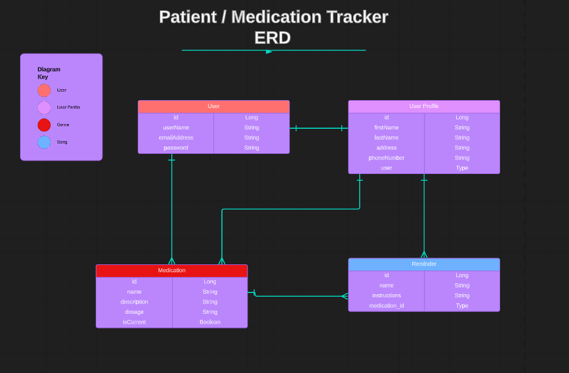

# Patient / Medication Tracker & Reminder API 

A RestAPI designed to allow patients / pharmacy customers to track current and past medications and set reminders for them. Users are able to search for, add, edit, and delete different medications and their reminders from their account / user profile. 

## Technologies Used

* Java 17
* Maven 
* Spring Boot
* Spring Data (JPA)
* Spring Security 
* JWT Tokens 
* H2 Database
* Postman 
* Apache Tomcat 
* MockMVC 
* Cucumber with Rest Assured 
* IntelliJ 

### General Approach

I started off by creating my user stories and acceptance criteria. This helped me visualize my end goals and outline what I wanted to achieve with this project. I also created a spreadsheet of all my HTTP methods and endpoints to keep track of which methods were supposed to hit which endpoint.

Finally, I created an ERD (entity relationship diagram) to plan my different models and their relevant attributes. This helped me to visualize their relationships to one another and plan out how I was going to link the corresponding tables in the database.

### Major Hurdles

When writing the tests for my Controller and Service classes, I was able to get all tests for the medication model to pass in both MockMVC and using Cucumber-Rest Assured before adding the security and authorization. However, after adding the security and authorization, the tests would no longer pass. All the endpoints work, so I know it's just a matter of me doing more research into how to refactor the test code for models that implement security and authorization, which I plan on doing in the near future.  

### Links
* User Stories - https://docs.google.com/document/d/1KTKWRJAiN2i-BFSEM_pHePvvJ_ciq0ii6ej0DfFLOsU/edit?usp=sharing

* HTTP requests/endpoints spreadsheet - https://docs.google.com/spreadsheets/d/1RojJb3knWkSgYE3XLzehLXKo2tuQJLuZdd0BcsWADXY/edit?usp=sharing

* ERD (entity relationship diagram) - https://lucid.app/lucidchart/3d409703-f2a7-49e0-b24f-2aff4ef96b20/edit?viewport_loc=-547%2C-21%2C3750%2C1557%2C0_0&invitationId=inv_b1b165af-6680-4a82-9f86-846e1a23d271

## Special Thanks

* Suresh Sigera - my instructor who taught me all the concepts used in this project. 
* [GitHub](https://github.com/sureshmelvinsigera) 

## Author

:woman_technologist: Erica Ayala

* [LinkedIn](https://www.linkedin.com/in/ayalavirtual)

* [GitHub](https://www.github.com/AyalaVirtual) 

